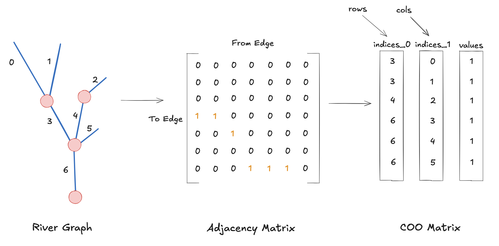

# Deep Groundwater Spec v0

!!! Warning
    This spec has not been accepted, and is subject to change

## Version

v0.1

## Editors
- Tadd Bindas (@taddyb), Earth Resources Technology (ERT)

## Issue Tracking

[Github Issues](https://github.com/DeepGroundwater/DeepGroundwater-specs/labels/V0%20Spec)

Copyright 2025-Present DeepGroundwater development team. This work is licensed under an Apache 2.0 [License](https://www.apache.org/licenses/LICENSE-2.0)

## Abstract

This specification defines the dataset formats for streamflow input ingestion, and geospatial references, to be used in Distributed Differentiable Routing (DDR).

## Introduction

This specification defines a format for datasets used in the DeepGroundwater Open Source Repositories. In the field of hydrology, there is a notion that "if a dataset can be opened in Pandas, or xarray, then it is good enough to share." The primary motication for the development of DeepGroundwater is to address the problems within the hydrological open source community through ensuring easy-to-reproduce experiments, maintaining consistency between data products, and providing logical interfaces to environmental models.

The format of this specification draws from the [Zarr v3 Spec](https://zarr-specs.readthedocs.io/en/latest/v3/core/index.html). This specification defines a format for multidimensional array data. 

We highlight the following areas motivating the development of this specification.

## Extensibility

The development of hydrological datasets, and models, is a very active field of research and development with a lot to be explored with the introduction of Deep Learning, Differentiable Modeling, and the constant innvoation of data products/open source services. A goal of this speficiation is to define a format with a clear structure that can be scaled to the global/continental level, while maintaining the [FAIR Principles](https://www.go-fair.org/fair-principles/). We aim to make this possible, whilst also providing pathways for a graceful degradation of functionality where possible, in order to retain interoperability.

## Stability Policy

This core specification adheres to a `MAJOR.MINOR` version numbering format. When incrementing the minor version, only additional features can be added. Breaking changes require incrementing the major version.

## Document Conventions
Conformance requirements are expressed with a combination of descriptive assertions and [RFC 2119](https://zarr-specs.readthedocs.io/en/latest/v3/stores/filesystem/index.html#rfc2119) terminology. The key words “MUST”, “MUST NOT”, “REQUIRED”, “SHALL”, “SHALL NOT”, “SHOULD”, “SHOULD NOT”, “RECOMMENDED”, “MAY”, and “OPTIONAL” in the normative parts of this document are to be interpreted as described in [RFC 2119](https://zarr-specs.readthedocs.io/en/latest/v3/stores/filesystem/index.html#rfc2119). However, for readability, these words do not appear in all uppercase letters in this specification.

All of the text of this specification is normative except sections explicitly marked as non-normative, examples, and notes. Examples in this specification are introduced with the words “for example”.

## Concepts and Terminology

This section introduces and defines some key terms and explains the conceptual model underpinning the DDR network format. 

The following figure illustrates how a river network can be described as a COO matrix:

Rather than describing a river network in a tabular format, where there are a series of to-from relationships between globally identified river segments, the adjacency matrix (and sparse COO matrix) use row / col ordering to provide full connectivity through array slicing. 

#### River Graph

A river graph is a collection of rivers which form to from -> to relationship. The graph nomenclature refers to a mathematical graph. 

#### Adjacency Matrix

An adjacency matrix is a square matrix representation of a river graph where each row and column corresponds to a river segment. Matrix entry (i,j) equals 1 if segment j flows directly into segment i (indicating a "to" relationship), and 0 otherwise. In the context of river networks, this creates a lower triangular matrix when segments are ordered topologically from upstream to downstream, ensuring that water flows only in the downstream direction.

#### COO Matrix

A COO (Coordinate) sparse matrix format efficiently stores the adjacency matrix by representing only the non-zero entries as three separate arrays: `indices_0` (row indices representing downstream segments), `indices_1` (column indices representing upstream segments), and `values` (connection indicators, typically 1 for direct connections). This format dramatically reduces storage requirements for sparse river networks where each segment typically connects to only a few others.

#### Network Topology

The spatial and connectivity structure of the river system, defining how individual river segments are connected to form the complete drainage network. The topology is preserved through the matrix representation, allowing for efficient upstream and downstream traversal operations.

#### Topological Ordering

A systematic arrangement of river segments where upstream segments appear before downstream segments in the matrix indexing. This ordering ensures the adjacency matrix maintains its lower triangular structure and enables efficient flow routing computations.
